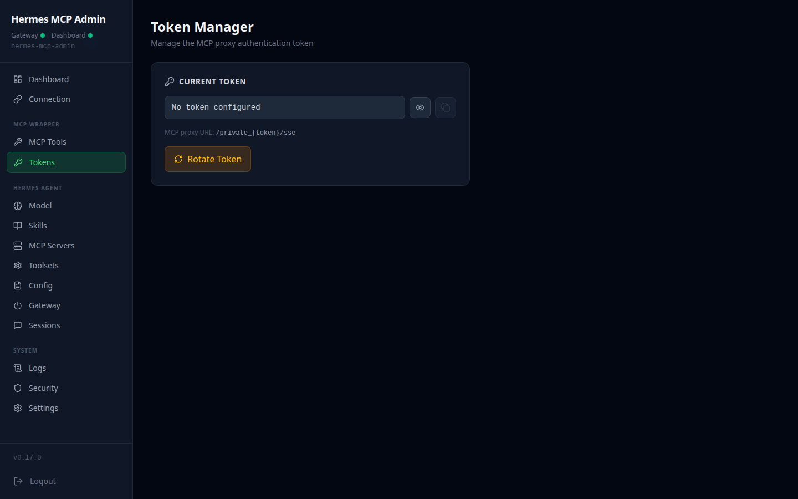
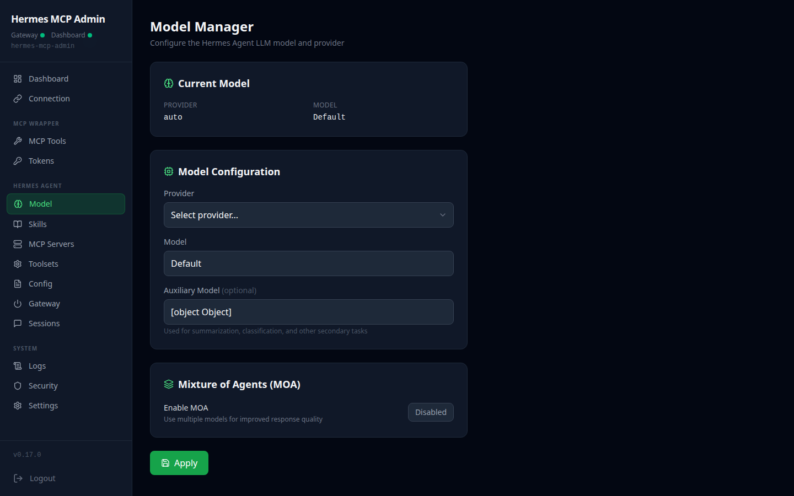
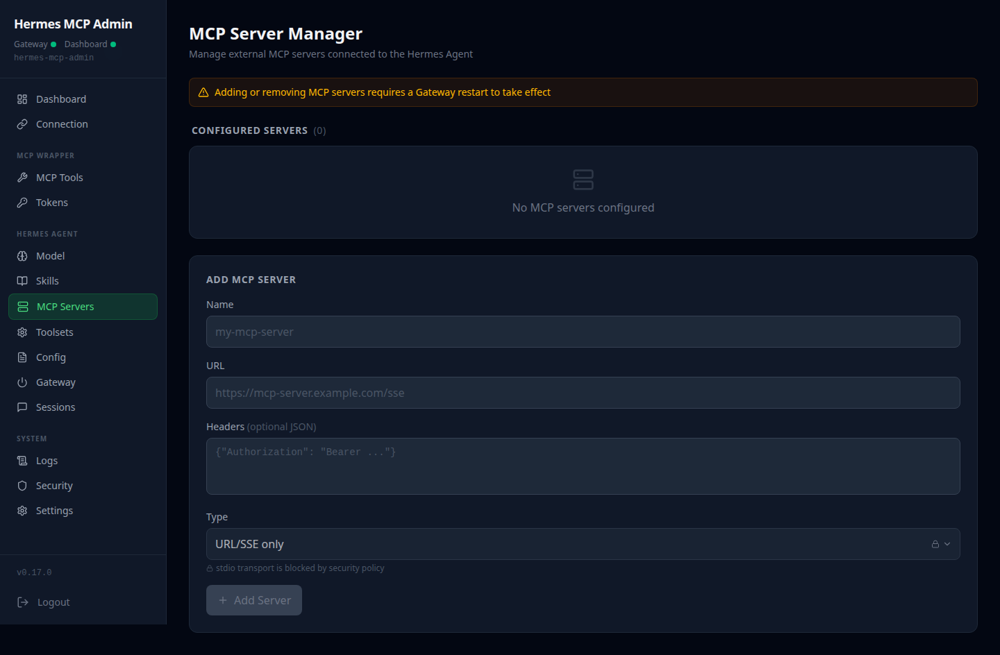
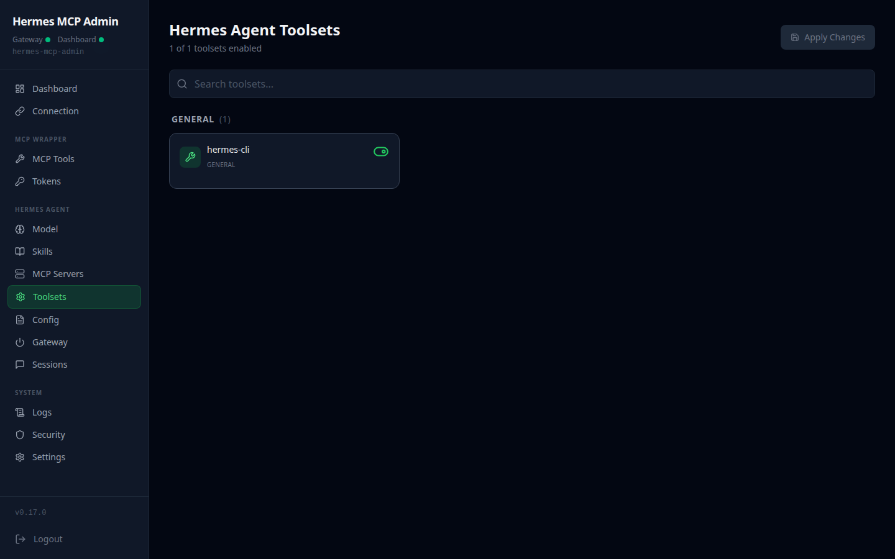
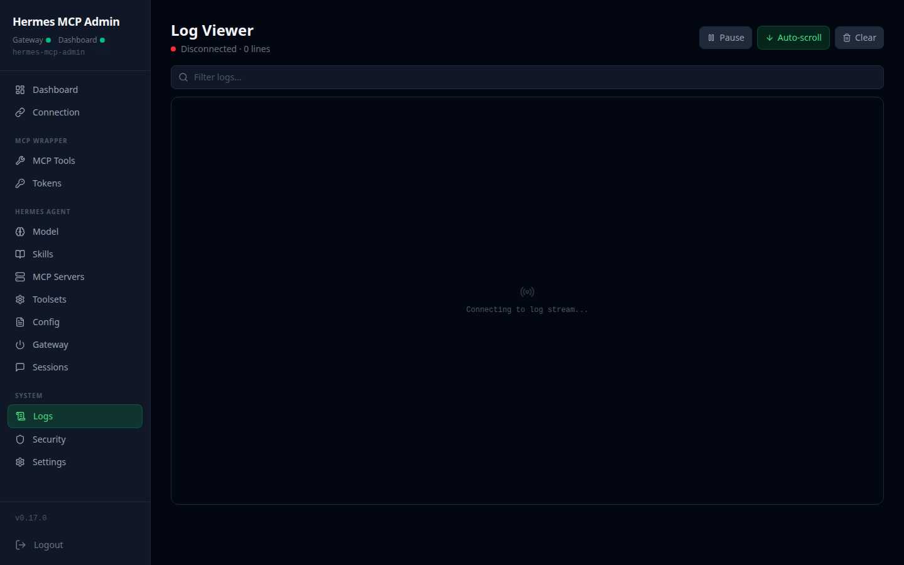
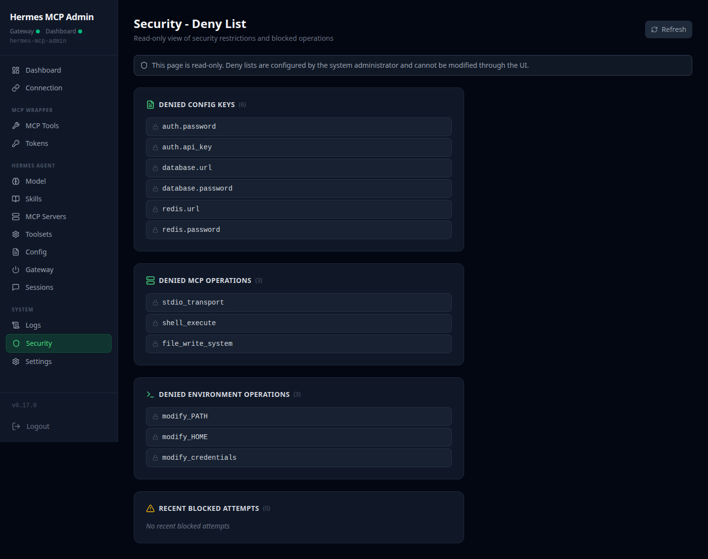

<p align="center">
  
</p>

<h1 align="center">Woow Hermes MCP Server</h1>

<p align="center">
  <strong>MCP Admin Wrapper for Hermes AI Agent</strong><br/>
  FastMCP server + Web Admin GUI for managing Hermes Agent instances via dual REST API
</p>

<p align="center">
  <a href="#features">Features</a> &bull;
  <a href="#architecture">Architecture</a> &bull;
  <a href="#module-structure">Modules</a> &bull;
  <a href="#screenshots">Screenshots</a> &bull;
  <a href="#installation">Installation</a> &bull;
  <a href="#configuration">Configuration</a> &bull;
  <a href="#api-reference">API</a> &bull;
  <a href="#mcp-tools">MCP Tools</a> &bull;
  <a href="#security">Security</a> &bull;
  <a href="README.zh-TW.md">中文文件</a>
</p>

<p align="center">
  
  
  
  
  
  
</p>

---

## Overview

**Woow Hermes MCP Server** is a full-stack admin wrapper that lets any MCP client (Claude Desktop, Claude Code, n8n, etc.) fully control a Hermes AI Agent instance through 9 FastMCP tools. It pairs a Python backend (FastAPI + FastMCP) with a React 19 Web Admin GUI, connecting to the Hermes Agent via two independent APIs -- the Gateway API for chat and sessions, and the Dashboard REST API for configuration and management.

<p align="center">
  
</p>

### Why This Package?

| Challenge | Solution |
|-----------|----------|
| Hermes Agent has two separate APIs with different auth methods | Unified dual-connection wrapper -- Gateway (Bearer) + Dashboard (Cookie) behind a single interface |
| MCP clients cannot natively manage Hermes configuration | 9 FastMCP tools expose inspect, skill, model, config, toolset, gateway, chat, session, and MCP server management |
| No web-based admin GUI for Hermes Agent operations | 15-page React SPA with dark theme, responsive sidebar, and real-time log streaming |
| Credentials are exposed when connecting AI to admin APIs | Dual auth credentials stay server-side -- MCP clients authenticate via a single URL-path token |
| Configuration changes risk breaking critical settings | Deny-list blocks dangerous config keys, stdio MCP transports, and env variable readback |
| Deploying Hermes management to Kubernetes is complex | Single-container deployment with multi-stage Docker build, K8s manifests, and Cloudflare Tunnel support |

---

## Features

### MCP Server (9 Tools)

- **hermes_inspect** -- Full snapshot of Gateway capabilities, Dashboard config, and model info
- **hermes_session** -- List, get, or delete Hermes chat sessions via Gateway API
- **hermes_skill** -- List, enable, or disable Hermes Agent skills via Dashboard API
- **hermes_mcp** -- Manage Hermes MCP server connections (list, add, remove) with stdio blocking
- **hermes_model** -- Switch AI model, provider, or list available providers
- **hermes_config** -- Read or update Dashboard configuration keys with deny-list enforcement
- **hermes_tools** -- Enable or disable Hermes Agent toolsets
- **hermes_gateway** -- Check Gateway status or trigger restart
- **hermes_chat** -- Send chat messages to Hermes and receive AI responses

### Web Admin GUI (15 Pages)

- **Dashboard** -- Dual connection health status with summary cards for model, tools, skills, sessions
- **Connection Config** -- Configure Gateway API + Dashboard API credentials with connectivity testing
- **Tool Manager** -- Enable/disable 9 MCP wrapper tools with category grouping (Read/Write/Agent)
- **Hermes Toolsets** -- Manage the Hermes Agent's own internal toolsets
- **Model Manager** -- View and switch AI model/provider configuration
- **Skill Manager** -- Browse, enable, and disable Hermes skills with Hub install support
- **MCP Server Manager** -- Manage MCP server connections registered inside the Hermes Agent
- **Config Editor** -- Full JSON config editor with deny-list protection for sensitive keys
- **Gateway Control** -- Gateway status monitoring, restart, and drain-restart controls
- **Session Manager** -- View, inspect, and bulk-delete chat sessions
- **Token Manager** -- Generate, rotate, and set MCP proxy authentication tokens
- **Log Viewer** -- Real-time SSE log streaming with regex search over a 5000-line ring buffer
- **Deny List** -- Read-only view of blocked config keys, MCP operations, and env operations
- **Settings** -- Full config.json management with per-section editing and MCP process controls
- **Login Page** -- JWT-based authentication with configurable admin password

### Infrastructure

- **Multi-stage Docker Build** -- Node 20 Alpine (frontend) + Python 3.12-slim (backend) in a single container
- **Kubernetes Ready** -- RBAC ServiceAccount, Deployment, ClusterIP Service on port 9003
- **Cloudflare Tunnel** -- Production endpoint at `hermes-mcp-admin.woowtech.io`
- **File-based Config** -- Portable `/data/config.json` store works across Docker, Podman, K3s, and bare-metal
- **MCP Subprocess Manager** -- Automatic start, stop, restart, and log draining for the MCP server process

---

## Architecture

```
┌─────────────────────────────────────────────────────────────────────────┐
│                     Woow Hermes MCP Server                              │
├─────────────────────────────────────────────────────────────────────────┤
│                                                                         │
│  MCP Client (Claude Desktop / Claude Code / n8n)                        │
│       │                                                                 │
│       │  Streamable HTTP: /private_{token}/sse                          │
│       ▼                                                                 │
│  ┌──────────────────────────────────────────────────────────────────┐   │
│  │              hermes_mcp_admin (FastAPI :9003)                    │   │
│  │                                                                  │   │
│  │  ┌──────────┐ ┌──────────┐ ┌────────┐ ┌──────┐ ┌────────────┐  │   │
│  │  │  config   │ │  tools   │ │ tokens │ │ logs │ │ dashboard  │  │   │
│  │  │  router   │ │  router  │ │ router │ │router│ │   proxy    │  │   │
│  │  └──────────┘ └──────────┘ └────────┘ └──────┘ └────────────┘  │   │
│  │       │             │            │         │          │          │   │
│  │  ┌────▼─────────────▼────────────▼─────────▼──────────▼──────┐  │   │
│  │  │                  mcp_admin_core                            │  │   │
│  │  │  ConfigStore │ AuthMiddleware │ ProcessMgr │ MCP Proxy     │  │   │
│  │  └──────────────────────────┬────────────────────────────────┘  │   │
│  │                             │                                   │   │
│  │  ┌──────────────────────────▼────────────────────────────────┐  │   │
│  │  │            hermes_mcp_server (FastMCP)                    │  │   │
│  │  │  9 Tools: inspect│session│skill│mcp│model│config│tools│   │  │   │
│  │  │            gateway│chat                                   │  │   │
│  │  └──────────────────────────┬────────────────────────────────┘  │   │
│  └─────────────────────────────┼────────────────────────────────────┘   │
│                                │                                        │
│              ┌─────────────────┴──────────────────┐                     │
│              ▼                                    ▼                     │
│  ┌────────────────────────┐        ┌────────────────────────────┐      │
│  │ [A] Gateway API :8642  │        │ [B] Dashboard REST API :9119│      │
│  │     Bearer auth        │        │     Cookie auth (v0.17.0)  │      │
│  │                        │        │                            │      │
│  │ • /v1/capabilities     │        │ • /api/config              │      │
│  │ • /v1/responses        │        │ • /api/skills              │      │
│  │ • /api/sessions/*      │        │ • /api/model/*             │      │
│  │ • /health              │        │ • /api/tools/*             │      │
│  └────────────────────────┘        │ • /api/status              │      │
│                                    │ • /auth/password-login     │      │
│                                    └────────────────────────────┘      │
│                                                                         │
│                    ┌────────────────────────────┐                        │
│                    │   Hermes Agent v0.17.0     │                        │
│                    └────────────────────────────┘                        │
└─────────────────────────────────────────────────────────────────────────┘
```

### System Flow (Mermaid)

```mermaid
graph TB
    subgraph MCP Clients
        CD[Claude Desktop]
        CC[Claude Code]
        N8N[n8n]
    end

    subgraph "Hermes MCP Admin (:9003)"
        PROXY[MCP Reverse Proxy<br/>/private_TOKEN/sse]
        API[FastAPI REST API<br/>/api/*]
        SPA[React 19 SPA<br/>15 Pages]
        MCP_SERVER[FastMCP Server<br/>9 Tools]
        CORE[mcp_admin_core<br/>Config + Auth + Process]
    end

    subgraph "Hermes Agent v0.17.0"
        GW["Gateway API :8642<br/>Bearer Auth"]
        DB["Dashboard API :9119<br/>Cookie Auth"]
    end

    CD -->|Streamable HTTP| PROXY
    CC -->|Streamable HTTP| PROXY
    N8N -->|Streamable HTTP| PROXY
    PROXY --> MCP_SERVER
    MCP_SERVER --> CORE
    SPA -->|REST| API
    API --> CORE
    MCP_SERVER -->|httpx| GW
    MCP_SERVER -->|httpx| DB
    API -->|Dashboard Proxy| DB
    API -->|Gateway Proxy| GW
    CORE -->|File Store| CONFIG[/data/config.json]
```

---

## Module Structure

The project is organized into three Python packages, each with a distinct responsibility:

### mcp_admin_core -- Shared Foundation

> Core library providing config store, auth middleware, process manager, and MCP reverse proxy. Designed for reuse across different MCP admin projects.

| Module | Description |
|--------|-------------|
| `config/store.py` | File-backed JSON config store with async API, caching, and auto-migration |
| `auth/middleware.py` | JWT authentication middleware + login router for `/api/*` routes |
| `process.py` | MCP subprocess manager with start/stop/restart and log draining |
| `proxy.py` | Reverse proxy routing `/private_{token}/*` to the MCP server with SSE streaming |
| `routers/settings.py` | Full config.json CRUD, admin password management, MCP process controls |
| `mcp_sse_wrapper.py` | Utility to run any MCP stdio server as an SSE HTTP server |
| `k8s/client.py` | Kubernetes API client for in-cluster operations |

### hermes_mcp_admin -- Admin API + Web GUI

> FastAPI application with 5 domain routers and a Dashboard proxy layer. Serves the React SPA and exposes REST endpoints for the admin GUI.

| Module | Description |
|--------|-------------|
| `main.py` | Application entry point, router registration via `create_app()` |
| `tool_registry.py` | Tool registry defining 9 tools in 3 categories (Read/Write/Agent) |
| `routers/config.py` | Dual connection config (Gateway + Dashboard) with connectivity testing |
| `routers/tools.py` | MCP tool enable/disable with per-tool operation granularity |
| `routers/tokens.py` | Token generation, rotation, and history with auto-restart on change |
| `routers/health.py` | Dual health checks + summary data (model, tools, skills, sessions) |
| `routers/logs.py` | SSE log streaming + regex search over a 5000-line ring buffer |
| `routers/dashboard_proxy.py` | Proxy layer for skills, model, MCP servers, toolsets, sessions, gateway, config editor, and deny list |

### hermes_mcp_server -- FastMCP Tools

> Pure MCP server package containing 9 tools that bridge the Hermes Gateway and Dashboard APIs. Runs as a subprocess managed by `mcp_admin_core`.

| Module | Description |
|--------|-------------|
| `server.py` | FastMCP server with 9 `@mcp.tool()` decorated functions and dual-connection helpers |

---

## Screenshots

### Login Page

JWT-based authentication with configurable admin password.

<p align="center">
  
</p>

### Dashboard

Dual connection health monitoring with summary cards for model, tools, skills, sessions, and MCP servers.

<p align="center">
  
</p>

### Connection Config

Configure Hermes Gateway API and Dashboard API credentials with one-click connectivity testing.

<p align="center">
  
</p>

### Tool Manager

Enable or disable 9 MCP tools organized by category (Read, Write, Agent) with per-tool operation control.

<p align="center">
  
</p>

### Token Manager

Generate, rotate, and manage MCP proxy authentication tokens with rotation history.

<p align="center">
  
</p>

### Model Manager

View and switch AI model and provider configuration for the Hermes Agent.

<p align="center">
  
</p>

### Skill Manager

Browse, enable, and disable Hermes Agent skills with Hub install support.

<p align="center">
  
</p>

### MCP Server Manager

Manage MCP server connections registered inside the Hermes Agent.

<p align="center">
  
</p>

### Hermes Toolsets

View and toggle the Hermes Agent's built-in toolsets.

<p align="center">
  
</p>

### Config Editor

Full JSON config editor with deny-list protection for sensitive keys.

<p align="center">
  
</p>

### Gateway Control

Gateway status monitoring with restart and drain-restart controls.

<p align="center">
  
</p>

### Session Manager

View, inspect, and bulk-delete Hermes chat sessions.

<p align="center">
  
</p>

### Log Viewer

Real-time SSE log streaming with regex search and a 5000-line in-memory ring buffer.

<p align="center">
  
</p>

### Deny List

Read-only view of blocked config keys, MCP operations, and environment variable operations.

<p align="center">
  
</p>

### Settings

Full config.json management with per-section editing, admin password change, and MCP process controls.

<p align="center">
  
</p>

### Mobile Responsive

Fully responsive dark-theme layout with collapsible sidebar for mobile devices.

<p align="center">
  
</p>

---

## Installation

### Prerequisites

- **Docker** or **Podman** (for containerized deployment)
- **Hermes Agent v0.17.0** running with Gateway API (:8642) and Dashboard API (:9119) accessible
- **Python 3.12+** (for development only)
- **Node 20+** (for frontend development only)

### Option 1: Docker Compose (Recommended)

```bash
# Clone the repository
git clone https://github.com/WOOWTECH/woow_hermes_mcp_server.git
cd woow_hermes_mcp_server

# Configure credentials
cp .env.example .env
# Edit .env with your Hermes Gateway and Dashboard credentials

# Start the service
docker compose up -d

# Access
# Admin GUI:  http://localhost:9003
# MCP endpoint:  http://localhost:9003/private_{token}/sse
```

### Option 2: Kubernetes (K3s/K8s)

```bash
# Create the namespace secret with Hermes credentials
kubectl create secret generic hermes-mcp-secrets \
  --namespace=kasim-odoo \
  --from-literal=gateway-url=http://hermes-agent-svc:8642 \
  --from-literal=gateway-api-key=YOUR_API_KEY \
  --from-literal=dashboard-url=http://hermes-agent-svc:9119 \
  --from-literal=dashboard-username=admin \
  --from-literal=dashboard-password=YOUR_PASSWORD

# Deploy
kubectl apply -f k8s-deploy.yaml

# Verify
kubectl get pods -n kasim-odoo -l app=hermes-mcp-admin
kubectl logs -n kasim-odoo -l app=hermes-mcp-admin -f
```

The K8s deployment includes:
- **ServiceAccount** with RBAC for secrets, configmaps, pods, and deployments
- **Deployment** with readiness and liveness probes on `/healthz`
- **ClusterIP Service** on port 9003
- Resource limits: 100m-500m CPU, 128Mi-512Mi memory

### Option 3: Development Setup

```bash
# Clone and install Python dependencies
git clone https://github.com/WOOWTECH/woow_hermes_mcp_server.git
cd woow_hermes_mcp_server
pip install -e ".[dev]"

# Build and serve frontend
cd frontend
npm install
npm run build
cd ..

# Copy build output for SPA serving
cp -r frontend/dist static

# Configure environment
export HERMES_GATEWAY_URL=http://localhost:8642
export HERMES_GATEWAY_API_KEY=your-api-key
export HERMES_DASHBOARD_URL=http://localhost:9119
export HERMES_DASHBOARD_USERNAME=admin
export HERMES_DASHBOARD_PASSWORD=your-password

# Start the server
uvicorn hermes_mcp_admin.main:app --host 0.0.0.0 --port 9003 --reload
```

---

## Configuration

### Environment Variables

| Variable | Description | Default |
|----------|-------------|---------|
| `HERMES_GATEWAY_URL` | Hermes Gateway API base URL | `http://hermes:8642` |
| `HERMES_GATEWAY_API_KEY` | Gateway Bearer authentication key | _(empty)_ |
| `HERMES_DASHBOARD_URL` | Hermes Dashboard REST API base URL | `http://hermes:9119` |
| `HERMES_DASHBOARD_USERNAME` | Dashboard login username | `admin` |
| `HERMES_DASHBOARD_PASSWORD` | Dashboard login password | _(empty)_ |
| `ADMIN_PASSWORD` | Admin GUI login password | `admin` |
| `JWT_SECRET` | Secret key for JWT token signing | _(auto-generated)_ |
| `JWT_EXPIRY_HOURS` | JWT token expiry duration in hours | `24` |
| `MCP_ADMIN_CONFIG` | Path to the JSON config file | `/data/config.json` |
| `MCP_AUTH_TOKEN` | Token for MCP proxy URL-path authentication | _(empty)_ |

### Config File Structure

The application stores all persistent configuration in a single JSON file (`/data/config.json`):

```json
{
  "admin_password": "your-admin-password",
  "mcp_auth_token": "hex-token-for-mcp-proxy",
  "connection": {
    "gateway_url": "http://hermes:8642",
    "gateway_api_key": "...",
    "dashboard_url": "http://hermes:9119",
    "dashboard_username": "admin",
    "dashboard_password": "..."
  },
  "tools": {
    "disabled": [],
    "disabled_operations": {}
  },
  "mcp_server": {
    "command": "python",
    "args": ["-m", "hermes_mcp_server.server"],
    "port": 8000,
    "env": {}
  },
  "proxy": {
    "timeout": 86400
  },
  "token_history": []
}
```

### Deny List

The following operations are blocked for security:

| Category | Blocked Items | Reason |
|----------|---------------|--------|
| Config Keys | `terminal.backend`, `api_server.cors_origins`, `api_server.host` | Prevent remote code execution and network exposure |
| MCP Operations | `add_stdio_command` | Block stdio/command-based MCP transports |
| Env Operations | `reveal` | Prevent credential readback |

---

## API Reference

### Authentication

| Endpoint | Method | Description |
|----------|--------|-------------|
| `/api/auth/login` | POST | Authenticate with admin password, returns JWT |
| `/healthz` | GET | Health check (no auth required) |

### Connection Config

| Endpoint | Method | Description |
|----------|--------|-------------|
| `/api/config` | GET | Current dual connection settings (secrets masked) |
| `/api/config/connection` | PUT | Update Gateway + Dashboard connection settings |
| `/api/config/test/gateway` | POST | Test Gateway API connectivity via `/v1/capabilities` |
| `/api/config/test/dashboard` | POST | Test Dashboard API connectivity via cookie login |

### Tool Management

| Endpoint | Method | Description |
|----------|--------|-------------|
| `/api/tools` | GET | List all 9 MCP tools with categories and enabled status |
| `/api/tools` | PUT | Update disabled tools list, restart MCP server |
| `/api/tools/operations` | PUT | Update per-tool disabled operations, restart MCP server |

### Token Management

| Endpoint | Method | Description |
|----------|--------|-------------|
| `/api/tokens` | GET | Current proxy token (masked) + rotation history |
| `/api/tokens/generate` | POST | Generate a random hex token (preview, not applied) |
| `/api/tokens/rotate` | POST | Generate, apply, and restart MCP server |
| `/api/tokens` | PUT | Set a specific token value and restart MCP server |

### Health & Monitoring

| Endpoint | Method | Description |
|----------|--------|-------------|
| `/api/health` | GET | Dual health check + summary data (model, tools, skills, sessions) |
| `/api/logs/stream` | GET | SSE endpoint streaming MCP server logs in real time |
| `/api/logs/search` | GET | Search the in-memory log buffer (plain text or regex) |

### Dashboard Proxy

| Endpoint | Method | Description |
|----------|--------|-------------|
| `/api/skills` | GET | List Hermes Agent skills |
| `/api/skills` | PUT | Update skill configuration |
| `/api/model` | GET | Current model and provider configuration |
| `/api/model/options` | GET | Available providers and models |
| `/api/model/set` | POST | Switch AI model |
| `/api/mcp-servers` | GET | List MCP servers registered in Hermes |
| `/api/mcp-servers` | POST | Add an MCP server |
| `/api/mcp-servers/{name}` | PUT/DELETE | Update or remove an MCP server |
| `/api/hermes-tools` | GET | List Hermes Agent toolsets |
| `/api/hermes-tools` | PUT | Update toolset configuration |
| `/api/sessions` | GET | List chat sessions |
| `/api/sessions/{id}` | DELETE | Delete a session |
| `/api/sessions/bulk-delete` | POST | Bulk delete sessions |
| `/api/gateway/status` | GET | Gateway running status |
| `/api/gateway/restart` | POST | Restart Gateway |
| `/api/gateway/drain-restart` | POST | Drain active connections then restart |
| `/api/config/editor` | GET | Full config for JSON editor (with denied keys list) |
| `/api/config/full` | PUT | Update full config |
| `/api/deny-list` | GET | Read-only deny list |

### Settings

| Endpoint | Method | Description |
|----------|--------|-------------|
| `/api/settings` | GET | Full config (passwords masked) |
| `/api/settings` | PUT | Replace full config |
| `/api/settings/{section}` | GET/PUT | Get or replace a config section |
| `/api/settings/mcp/status` | GET | MCP server process status |
| `/api/settings/mcp/restart` | POST | Restart MCP server process |
| `/api/settings/mcp_auth_token/rotate` | POST | Rotate MCP auth token |

### MCP Proxy

| Endpoint | Method | Description |
|----------|--------|-------------|
| `/private_{token}/sse` | GET | MCP SSE connection endpoint |
| `/private_{token}/{path}` | ALL | Reverse proxy to MCP server subprocess |

---

## MCP Tools

The FastMCP server exposes 9 tools organized into 3 categories:

### Read (2 tools)

Read-only inspection and query tools that do not modify any state.

| Tool | API | Description |
|------|-----|-------------|
| `hermes_inspect` | [A]+[B] | Inspect Gateway capabilities (`GET /v1/capabilities`), Dashboard config (`GET /api/config`), and model info (`GET /api/model/info`) |
| `hermes_session` | [A] | List (`GET /api/sessions`), get (`GET /api/sessions/{id}`), or delete (`DELETE /api/sessions/{id}`) chat sessions |

### Write (6 tools)

Mutating operations that modify Hermes Agent configuration. All write tools support `dry_run` mode.

| Tool | API | Actions | Description |
|------|-----|---------|-------------|
| `hermes_skill` | [B] | list, enable, disable | Manage Hermes Agent skills via `/api/skills` endpoints |
| `hermes_mcp` | [B] | list, add, remove | Manage MCP server connections via `/api/mcp`. Stdio/command transports are blocked |
| `hermes_model` | [B] | info, set, list | Switch model or provider via `/api/model/*` |
| `hermes_config` | [B] | get, set | Read or write Dashboard config keys via `/api/config`. Deny-list enforced |
| `hermes_tools` | [B] | list, enable, disable | Toggle Hermes toolsets via `/api/tools/toolsets` |
| `hermes_gateway` | [B] | status, restart | Check Gateway status or trigger restart via `/api/status` and `/api/gateway/restart` |

### Agent (1 tool)

Interactive conversational tool.

| Tool | API | Description |
|------|-----|-------------|
| `hermes_chat` | [A] | Send a chat message via `POST /v1/responses` (new session) or `POST /api/sessions/{id}/chat` (continue session) |

**Legend:** [A] = Gateway API (:8642, Bearer auth) | [B] = Dashboard API (:9119, Cookie auth)

### Tool Categories Explained

```
┌─────────────────────────────────────────────────────────────┐
│                    9 MCP Tools                               │
├──────────────┬──────────────────────┬────────────────────────┤
│  Read (2)    │  Write (6)           │  Agent (1)             │
│              │                      │                        │
│ hermes_      │ hermes_skill         │ hermes_chat            │
│   inspect    │ hermes_mcp           │                        │
│ hermes_      │ hermes_model         │                        │
│   session    │ hermes_config        │                        │
│              │ hermes_tools         │                        │
│              │ hermes_gateway       │                        │
│              │                      │                        │
│ Safe, no     │ Mutating, deny-list  │ Conversational,        │
│ side effects │ + dry_run support    │ session-aware           │
└──────────────┴──────────────────────┴────────────────────────┘
```

---

## Security

### Authentication Layers

```
┌─────────────────────────────────────────────────────────────┐
│                   Security Architecture                      │
│                                                              │
│  Layer 1: MCP Proxy Auth                                     │
│  ┌────────────────────────────────────────────────────────┐  │
│  │  URL-path token: /private_{TOKEN}/sse                  │  │
│  │  Token stored in /data/config.json (never in env)      │  │
│  │  Rotatable via API or GUI                              │  │
│  └────────────────────────────────────────────────────────┘  │
│                                                              │
│  Layer 2: Admin GUI Auth                                     │
│  ┌────────────────────────────────────────────────────────┐  │
│  │  JWT (HS256) via POST /api/auth/login                  │  │
│  │  HttpOnly + SameSite=Strict cookie                     │  │
│  │  Configurable expiry (default 24h)                     │  │
│  │  Bearer header, cookie, or query param fallback (SSE)  │  │
│  └────────────────────────────────────────────────────────┘  │
│                                                              │
│  Layer 3: Hermes Dual Auth (server-side only)                │
│  ┌────────────────────────────────────────────────────────┐  │
│  │  Gateway:   Bearer API_SERVER_KEY → never exposed      │  │
│  │  Dashboard: Cookie hermes_session_at → never exposed   │  │
│  │  Credentials cached server-side (10 min cookie TTL)    │  │
│  └────────────────────────────────────────────────────────┘  │
└─────────────────────────────────────────────────────────────┘
```

### Security Features

- **Deny List** -- Blocks writes to dangerous config keys (`terminal.backend`, `api_server.cors_origins`, `api_server.host`)
- **Stdio Transport Blocking** -- MCP server `add` action rejects `stdio:` and `command:` URLs to prevent shell injection
- **Environment Isolation** -- Hermes API credentials stay server-side, never sent to MCP clients
- **Constant-Time Password Comparison** -- `secrets.compare_digest` prevents timing attacks on login
- **Token Masking** -- All API responses mask sensitive values (passwords, API keys, tokens)
- **Write-Only Env Keys** -- Environment variable readback is denied to prevent credential exfiltration
- **Dry Run Mode** -- All write tools support `dry_run=true` for safe previewing of changes
- **RBAC (K8s)** -- ServiceAccount with minimal permissions scoped to namespace (secrets, configmaps, pods, deployments)
- **Liveness & Readiness Probes** -- K8s health checks on `/healthz` with configurable intervals

---

## Contributing

### Development Setup

```bash
# Install in development mode
pip install -e ".[dev]"

# Run tests
pytest

# Frontend development (hot reload)
cd frontend
npm install
npm run dev
```

### Project Structure

```
woow_hermes_mcp_server/
├── mcp_admin_core/          # Shared foundation package
│   ├── auth/                # JWT middleware + login
│   ├── config/              # File-backed config store
│   ├── k8s/                 # Kubernetes client
│   ├── routers/             # Settings router
│   ├── app.py               # FastAPI application factory
│   ├── process.py           # MCP subprocess manager
│   ├── proxy.py             # MCP reverse proxy
│   └── mcp_sse_wrapper.py   # SSE transport wrapper
├── hermes_mcp_admin/        # Admin API + Web GUI
│   ├── routers/             # 5 domain routers + dashboard proxy
│   ├── main.py              # App entry point
│   └── tool_registry.py     # 9-tool registry (3 categories)
├── hermes_mcp_server/       # FastMCP server
│   └── server.py            # 9 MCP tools
├── frontend/                # React 19 + Vite + Tailwind CSS 4
│   └── src/
│       ├── pages/           # 15 page components
│       └── components/      # Sidebar, StatusCard
├── docs/screenshots/        # 16 screenshots
├── Dockerfile               # Multi-stage Node 20 + Python 3.12
├── docker-compose.yml       # Docker Compose config
├── k8s-deploy.yaml          # K8s manifests (RBAC + Deploy + Service)
├── deny-list.yaml           # Security deny-list
├── pyproject.toml           # Python project config
└── .env.example             # Environment variable template
```

### Coding Conventions

- Python: type hints on all function signatures, async/await for I/O
- Pydantic models for all request/response schemas
- Each router is a self-contained module with its own Pydantic models
- Frontend: functional React components with hooks, Tailwind CSS utility classes

---

## License

This project is licensed under the **MIT License**.

See [LICENSE](LICENSE) for details.

---

<p align="center">
  <sub>Built by <a href="https://github.com/WOOWTECH">WOOWTECH</a> &bull; Powered by Hermes Agent v0.17.0 + FastMCP</sub>
</p>
