<p align="center">
  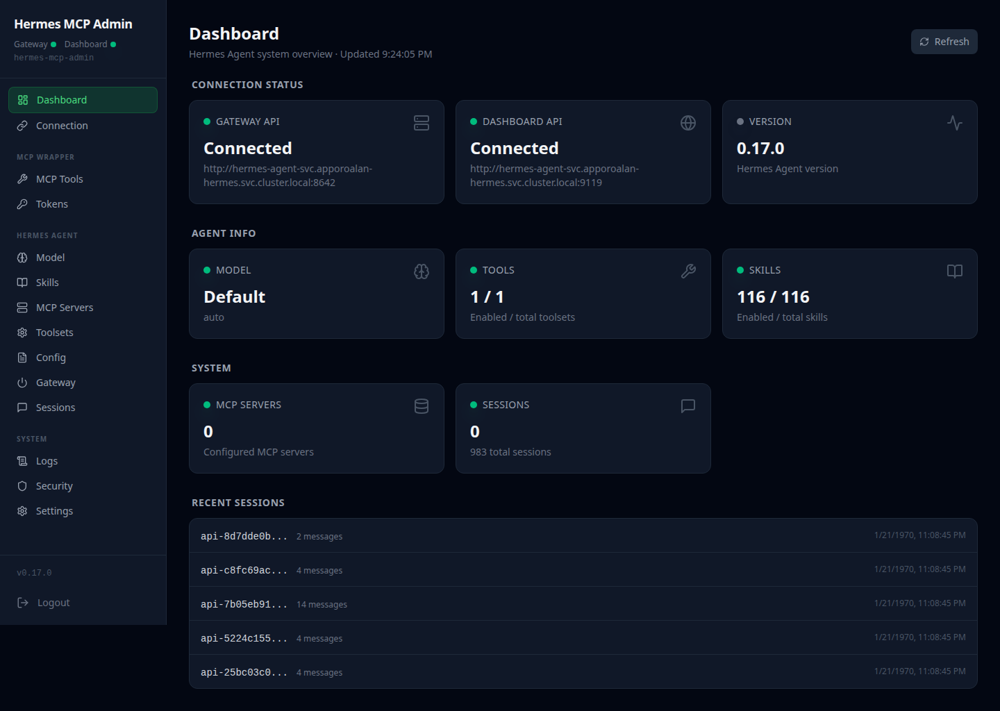
</p>

<h1 align="center">Woow Hermes MCP Server</h1>

<p align="center">
  <strong>Hermes AI Agent 的 MCP (Model Context Protocol) 管理封裝</strong><br/>
  FastMCP 伺服器 + Web 管理介面，透過雙 REST API (Gateway + Dashboard) 管理 Hermes Agent 實體
</p>

<p align="center">
  <a href="#總覽">總覽</a> &bull;
  <a href="#功能特色">功能特色</a> &bull;
  <a href="#系統架構">系統架構</a> &bull;
  <a href="#模組結構">模組結構</a> &bull;
  <a href="#截圖展示">截圖展示</a> &bull;
  <a href="#安裝指南">安裝指南</a> &bull;
  <a href="#設定說明">設定說明</a> &bull;
  <a href="#api-參考">API 參考</a> &bull;
  <a href="#mcp-工具">MCP 工具</a> &bull;
  <a href="#安全性">安全性</a> &bull;
  <a href="README.md">English</a>
</p>

<p align="center">
  
  
  
  
  
  
  
  
</p>

---

## 總覽

**woow-hermes-mcp-server** 是一套完整的 MCP (Model Context Protocol) 管理解決方案，專為 [Hermes AI Agent](https://github.com/WOOWTECH) 打造。它將 FastMCP 伺服器與全功能 Web 管理介面合而為一，讓 Claude Desktop 等 MCP 客戶端能夠透過 9 個標準化工具，完整控制遠端 Hermes Agent 實體的所有面向 — 從技能管理、模型切換、對話互動到 Gateway 控制。

<p align="center">
  
</p>

### 為什麼需要此套件？

| 問題痛點 | 解決方案 |
|----------|----------|
| Hermes Agent 沒有標準化的遠端管控介面 | 提供 9 個 MCP 工具，讓 Claude 等 AI 助手直接管理 Agent |
| 手動切換模型、安裝技能需要直接操作伺服器 | Web GUI 提供 15 個管理頁面，一站式視覺化操作 |
| Gateway API 與 Dashboard API 各自獨立 | 統一代理層自動處理雙連線驗證與路由 |
| 敏感設定容易被誤改 | Deny-list 阻擋危險設定鍵，環境變數僅限寫入 |
| 缺乏 Kubernetes 原生部署支援 | 內建 K8s manifests，含 RBAC、Service、Deployment 完整配置 |
| MCP 伺服器連線缺乏安全機制 | 基於 URL 路徑的 Token 驗證，雙層 API 憑證永不暴露給客戶端 |

---

## 功能特色

### MCP 伺服器 (9 個工具)

- **hermes_inspect** — 完整快照：Agent 能力、設定、模型狀態一覽
- **hermes_session** — 對話管理：列出、讀取、分叉、刪除 Agent 會話
- **hermes_skill** — 技能管理：列出、搜尋、安裝、啟用、停用技能
- **hermes_model** — 模型切換：即時更換 AI 供應商、模型、輔助模型
- **hermes_mcp_server_manage** — MCP 伺服器管理：列出、新增、移除、啟用、測試
- **hermes_config** — 設定讀寫：Deny-list 保護的設定鍵存取
- **hermes_gateway** — Gateway 控制：狀態查詢、服務重啟
- **hermes_chat** — 對話互動：透過 Gateway API 與 Agent 對話
- **hermes_tools** — 工具集管理：啟用、停用 Agent 內建工具集

### Web 管理介面 (15 個頁面)

- **Dashboard** — 雙連線狀態監控（Gateway + Dashboard）
- **Connection** — 雙 API 連線設定與驗證測試
- **MCP Tools** — 9 個 MCP 包裝工具的管理與測試
- **Hermes Toolsets** — 21 個 Agent 內建工具集的啟停控制
- **Model Manager** — AI 模型供應商與參數管理
- **Skills Manager** — 技能列表、Hub 安裝與狀態管理
- **MCP Servers Manager** — 外部 MCP 伺服器連線管理
- **Config Editor** — Deny-list 保護的設定編輯器
- **Gateway Control** — Gateway 服務狀態與重啟
- **Sessions Manager** — 對話歷史管理與檢視
- **Tokens Manager** — MCP 存取令牌管理
- **Log Viewer** — 即時日誌檢視器
- **Deny List** — 安全阻擋清單（唯讀）
- **Permission Editor** — 權限設定編輯
- **Settings** — 系統設定

### 核心能力

- **雙 API 橋接** — 自動處理 Gateway (Bearer) 與 Dashboard (Cookie) 雙重驗證
- **Deny-list 安全機制** — 阻擋 `terminal.backend`、CORS、`0.0.0.0` 綁定等危險設定
- **Dry Run 支援** — 所有寫入工具支援 `dry_run=true`，預覽變更不實際執行
- **K8s 原生部署** — 完整的 K3s/K8s manifests，含 RBAC、ServiceAccount、Deployment
- **Cloudflare Tunnel** — 透過 `hermes-mcp-admin.woowtech.io` 安全存取
- **深色主題** — 全面深色 UI 設計，降低視覺疲勞
- **響應式設計** — 桌面與行動裝置自適應佈局

---

## 系統架構

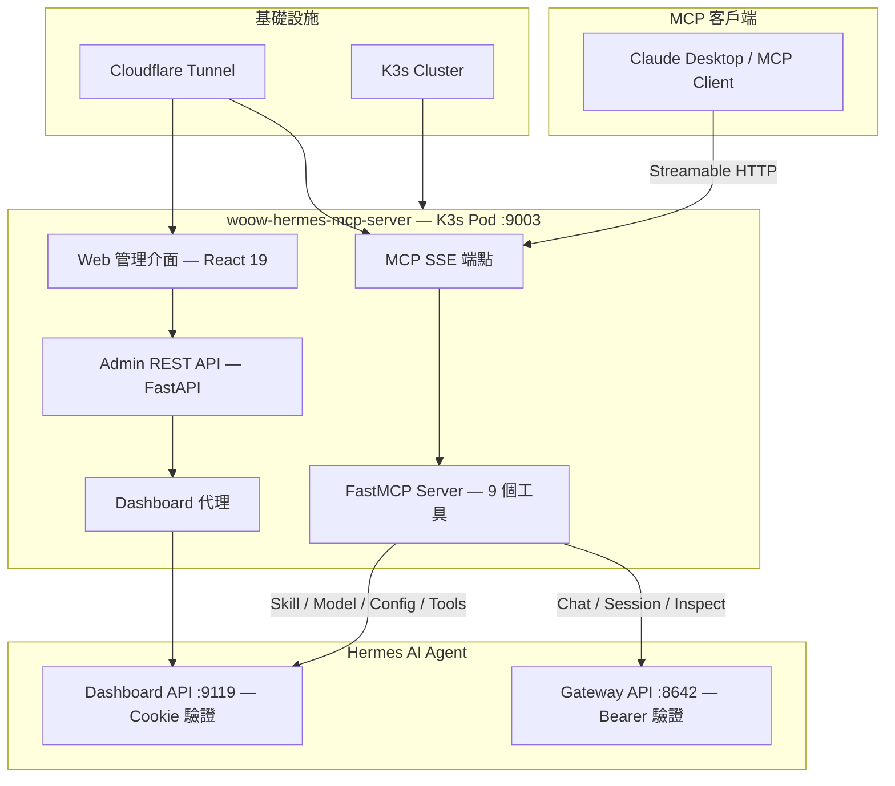

### 連線架構

```
Claude app ──(Streamable HTTP, /private_{token}/sse)──► woow-hermes-mcp (FastMCP, K3s)
                                                              │
                          ┌───────────────────────────────────┴──────────────────┐
                          ▼                                                      ▼
              [A] Gateway API Server :8642                         [B] Dashboard REST API :9119
                  Bearer API_SERVER_KEY                                Cookie 驗證 (Basic Auth)
```

### 容器架構

```
┌─────────────────────────────────────────────────────────────────┐
│                woow-hermes-mcp-server 容器                       │
├─────────────────────────────────────────────────────────────────┤
│                                                                  │
│  ┌────────────────────────┐   ┌────────────────────────────┐    │
│  │   hermes_mcp_server    │   │     hermes_mcp_admin       │    │
│  │                        │   │                            │    │
│  │ • FastMCP 伺服器       │   │ • FastAPI 管理 API         │    │
│  │ • 9 個 MCP 工具        │   │ • 5 個路由 + Dashboard 代理│    │
│  │ • SSE 串流             │   │ • 靜態檔案服務             │    │
│  │ • Token 驗證           │   │ • JWT 驗證                 │    │
│  └────────────┬───────────┘   └────────────┬───────────────┘    │
│               │                            │                    │
│               └────────────┬───────────────┘                    │
│                            │                                    │
│               ┌────────────▼───────────┐                        │
│               │    mcp_admin_core      │                        │
│               │                        │                        │
│               │ • 共享基礎模組          │                        │
│               │ • 應用程式工廠          │                        │
│               │ • 驗證引擎             │                        │
│               │ • K8s 整合             │                        │
│               │ • 程序管理             │                        │
│               │ • 代理模組             │                        │
│               └────────────────────────┘                        │
│                                                                  │
│  ┌──────────────────────────────────────────────────────────┐   │
│  │                  React 19 前端 (靜態檔案)                  │   │
│  │  15 個頁面 │ 響應式側邊欄 │ 深色主題 │ TanStack Query      │   │
│  └──────────────────────────────────────────────────────────┘   │
│                                                                  │
├──────────────────────────────────────────────────────────────────┤
│                            Port 9003                             │
│                   (Admin GUI + MCP SSE 端點)                      │
└──────────────────────────────────────────────────────────────────┘
```

---

## 模組結構

### mcp_admin_core — 共享基礎模組

> 核心基礎函式庫，`hermes_mcp_admin` 和 `hermes_mcp_server` 共同依賴此模組。

- 應用程式工廠 (`create_app`) — FastAPI 應用建立器
- JWT 驗證引擎 — 安全的存取控制
- K8s 整合 — ServiceAccount、Secret、ConfigMap 操作
- MCP SSE 封裝 — Streamable HTTP 代理
- 程序管理 — 子程序啟停與監控
- HTTP 代理模組 — Dashboard API 反向代理

**子模組：**

| 子模組 | 說明 |
|--------|------|
| `auth/` | JWT 驗證、Token 管理 |
| `config/` | 設定載入、環境變數管理 |
| `k8s/` | Kubernetes API 整合 |
| `routers/` | 共用 API 路由 (settings) |
| `app.py` | FastAPI 應用程式工廠 |
| `process.py` | 子程序管理器 |
| `proxy.py` | HTTP 反向代理 |
| `mcp_sse_wrapper.py` | MCP SSE 串流封裝 |

### hermes_mcp_admin — FastAPI 管理服務

> Web 管理介面的後端 API 服務，提供 5 個路由模組加上 Dashboard 代理。

- 設定管理路由 (`config.py`) — Hermes 設定讀寫
- 工具管理路由 (`tools.py`) — MCP 工具註冊與管理
- Token 管理路由 (`tokens.py`) — MCP 存取令牌 CRUD
- 健康檢查路由 (`health.py`) — 服務健康狀態
- 日誌路由 (`logs.py`) — 即時日誌串流
- Dashboard 代理路由 (`dashboard_proxy.py`) — Hermes Dashboard API 反向代理

**依賴：** mcp_admin_core

### hermes_mcp_server — FastMCP 伺服器

> 9 個 MCP 工具的實作，橋接 Gateway API 與 Dashboard API。

- 自動偵測連線設定（環境變數）
- 雙 API 客戶端（Gateway Bearer + Dashboard Cookie）
- Deny-list 過濾（config 寫入保護）
- 完整的錯誤處理與 dry_run 支援

**依賴：** mcp_admin_core, FastMCP (mcp>=1.0)

### frontend — React 管理介面

> 15 個管理頁面，採用深色主題設計的全功能 Web 管理介面。

- **框架：** React 19 + React Router 7
- **建構工具：** Vite 6
- **樣式：** Tailwind CSS 4
- **狀態管理：** TanStack React Query 5
- **圖示：** Lucide React
- **設計：** 深色主題、響應式側邊欄

**頁面清單 (16 個)：**

| 頁面 | 檔案 | 說明 |
|------|------|------|
| Dashboard | `Dashboard.jsx` | 雙連線狀態監控面板 |
| Connection | `ConnectionConfig.jsx` | Gateway + Dashboard 連線設定 |
| Login | `LoginPage.jsx` | 管理員登入頁面 |
| MCP Tools | `ToolManager.jsx` | 9 個 MCP 工具管理 |
| Hermes Toolsets | `HermesToolsets.jsx` | Agent 內建工具集管理 |
| Model Manager | `ModelManager.jsx` | AI 模型切換與設定 |
| Skills Manager | `SkillManager.jsx` | 技能安裝與管理 |
| MCP Servers | `McpServerManager.jsx` | 外部 MCP 伺服器管理 |
| Config Editor | `ConfigEditor.jsx` | 設定鍵值編輯器 |
| Gateway Control | `GatewayControl.jsx` | Gateway 狀態與重啟 |
| Sessions | `SessionManager.jsx` | 對話歷史管理 |
| Tokens | `TokenManager.jsx` | MCP 存取令牌管理 |
| Log Viewer | `LogViewer.jsx` | 即時日誌檢視 |
| Deny List | `DenyList.jsx` | 安全阻擋清單 |
| Permissions | `PermissionEditor.jsx` | 權限編輯器 |
| Settings | `SettingsPage.jsx` | 系統設定 |

---

## 截圖展示

### Dashboard — 雙連線狀態監控

一目了然的系統狀態面板，同時顯示 Gateway API 與 Dashboard API 的連線狀態。

<p align="center">
  
</p>

### Connection — 雙 API 連線設定

設定 Gateway API (Bearer 驗證) 和 Dashboard API (Cookie 驗證) 的連線參數，支援一鍵測試連線。

<p align="center">
  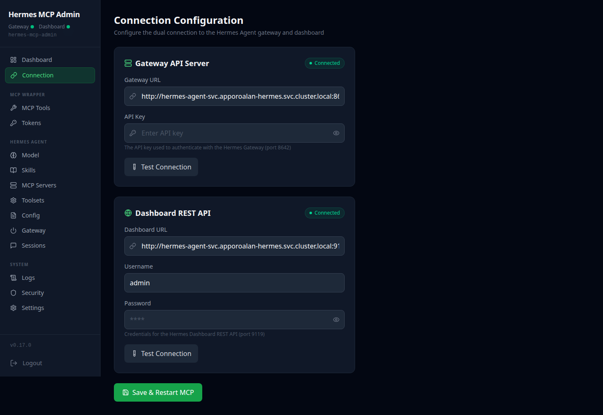
</p>

### Login — 管理員登入

安全的管理員登入頁面，深色主題設計。

<p align="center">
  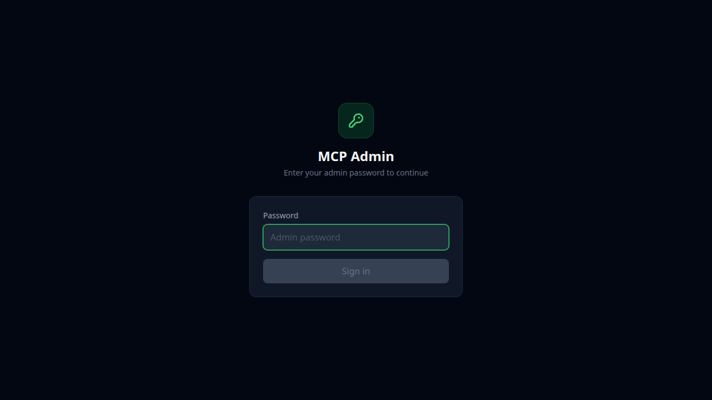
</p>

### Skills Manager — 技能管理

瀏覽、搜尋、安裝和管理 Hermes Agent 的技能模組。

<p align="center">
  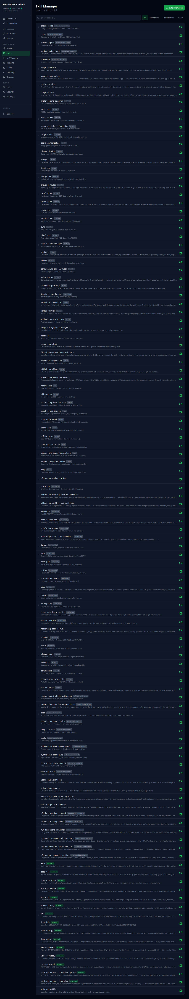
</p>

### Tool Manager — MCP 工具管理

管理和測試 9 個 MCP 包裝工具，查看工具參數與回傳結果。

<p align="center">
  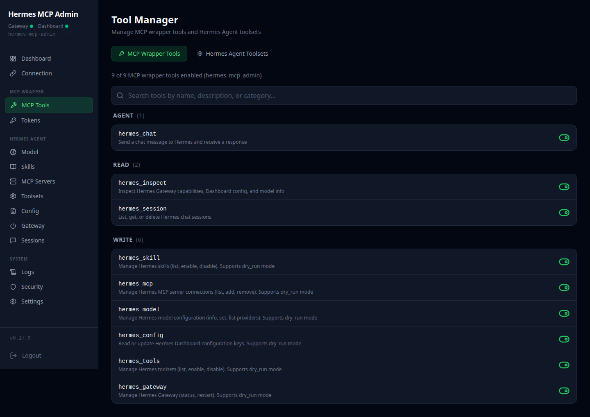
</p>

### Config Editor — 設定編輯器

Deny-list 保護的設定鍵值編輯器，防止誤改危險設定。

<p align="center">
  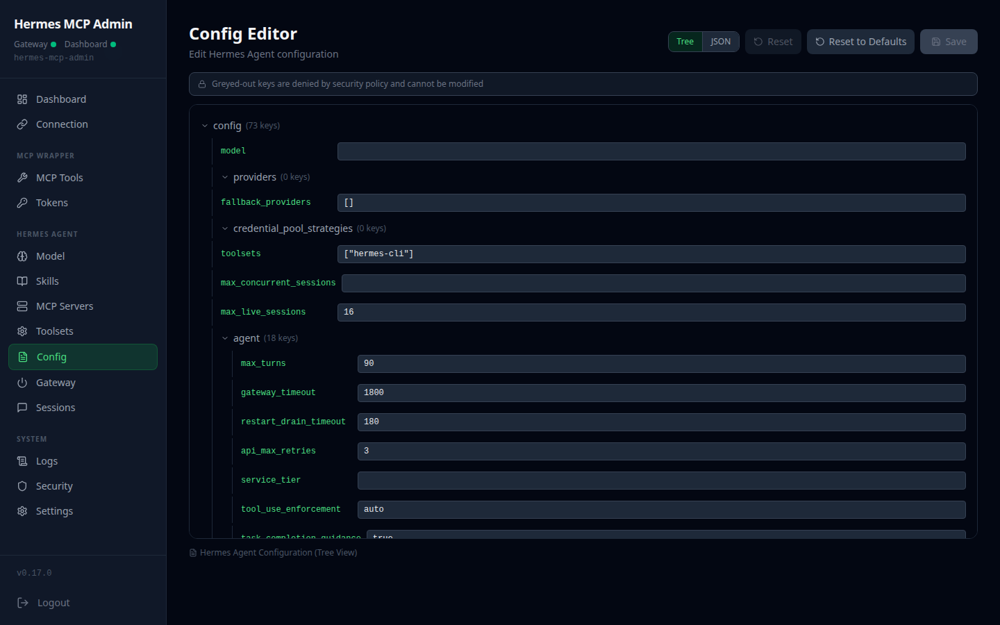
</p>

### Gateway Control — Gateway 控制

Gateway 服務狀態監控與遠端重啟控制。

<p align="center">
  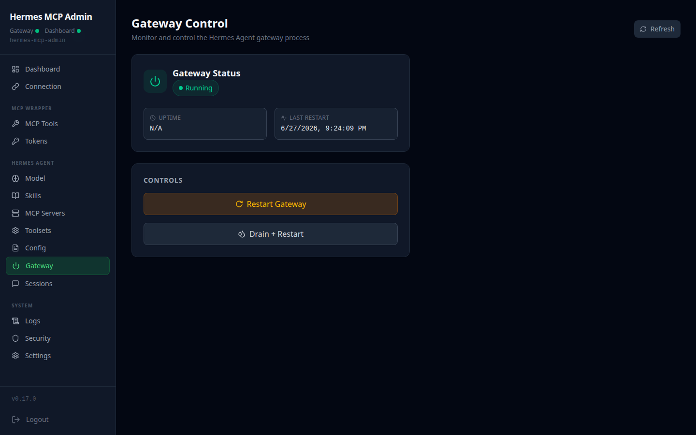
</p>

### Session Manager — 對話管理

檢視、分叉、刪除 Agent 的對話歷史記錄。

<p align="center">
  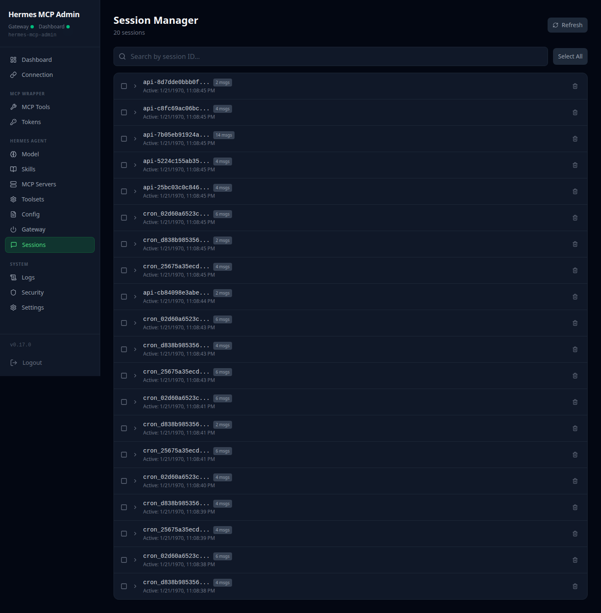
</p>

### Settings — 系統設定

系統層級設定與偏好管理。

<p align="center">
  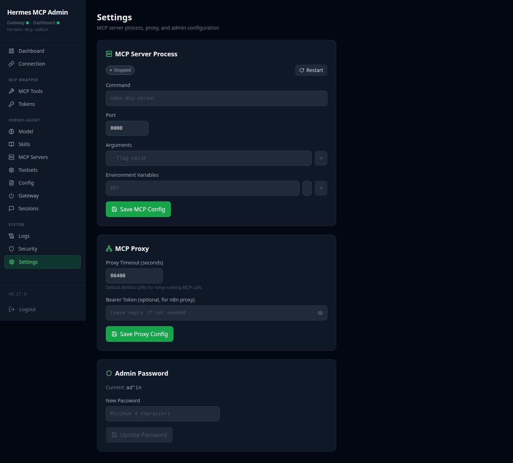
</p>

### Dashboard — 行動裝置版

響應式設計，在行動裝置上同樣提供完整的管理體驗。

<p align="center">
  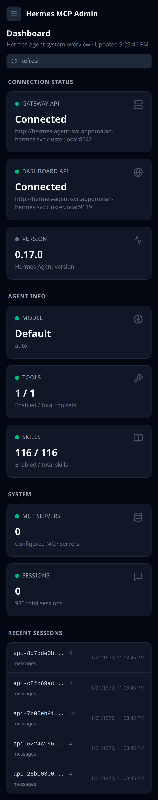
</p>

---

## 安裝指南

### 系統需求

- **Python 3.12+**
- **Node.js 20+**（前端建構）
- **Docker / Podman**（容器部署）
- **K3s / K8s**（Kubernetes 部署，選用）

### 方式一：Docker Compose（推薦）

```bash
# 複製專案
git clone https://github.com/WOOWTECH/woow-hermes-mcp-server.git
cd woow-hermes-mcp-server

# 設定環境變數
cp .env.example .env
# 編輯 .env，填入 Hermes Agent 連線資訊：
#   HERMES_GATEWAY_URL=http://hermes:8642
#   HERMES_GATEWAY_API_KEY=your-api-key
#   HERMES_DASHBOARD_URL=http://hermes:9119
#   HERMES_DASHBOARD_USERNAME=admin
#   HERMES_DASHBOARD_PASSWORD=your-password

# 啟動服務
docker compose up -d

# 存取
# 管理介面：http://localhost:9003
# MCP 端點：http://localhost:9003/private_{token}/sse
```

### 方式二：Kubernetes (K3s) 部署

```bash
# 建立命名空間
kubectl create namespace hermes-mcp-admin

# 建立 Secret（連線憑證）
kubectl create secret generic hermes-mcp-admin-env \
  -n hermes-mcp-admin \
  --from-literal=HERMES_GATEWAY_URL=http://hermes:8642 \
  --from-literal=HERMES_GATEWAY_API_KEY=your-api-key \
  --from-literal=HERMES_DASHBOARD_URL=http://hermes:9119 \
  --from-literal=HERMES_DASHBOARD_USERNAME=admin \
  --from-literal=HERMES_DASHBOARD_PASSWORD=your-password

# 部署
kubectl apply -f k8s-deploy.yaml -n hermes-mcp-admin

# 驗證
kubectl get pods -n hermes-mcp-admin
```

### 方式三：本機開發

```bash
# 安裝 Python 依賴
pip install -e ".[dev]"

# 安裝前端依賴
cd frontend && npm install && cd ..

# 前端開發模式
cd frontend && npm run dev &

# 啟動後端
export HERMES_GATEWAY_URL=http://localhost:8642
export HERMES_GATEWAY_API_KEY=your-api-key
export HERMES_DASHBOARD_URL=http://localhost:9119
export HERMES_DASHBOARD_USERNAME=admin
export HERMES_DASHBOARD_PASSWORD=your-password

uvicorn hermes_mcp_admin.main:app --host 0.0.0.0 --port 9003 --reload
```

### 方式四：Docker 手動建構

```bash
# 建構映像
docker build -t hermes-mcp-admin .

# 執行容器
docker run -d \
  -p 9003:8080 \
  -v hermes-data:/data \
  -e HERMES_GATEWAY_URL=http://hermes:8642 \
  -e HERMES_GATEWAY_API_KEY=your-api-key \
  -e HERMES_DASHBOARD_URL=http://hermes:9119 \
  -e HERMES_DASHBOARD_USERNAME=admin \
  -e HERMES_DASHBOARD_PASSWORD=your-password \
  hermes-mcp-admin
```

---

## 設定說明

### 1. 連線設定

本套件需要連線至一個執行中的 Hermes AI Agent 實體，透過兩個 API 進行通訊：

| API | 連接埠 | 驗證方式 | 用途 |
|-----|--------|----------|------|
| **Gateway API** | `:8642` | Bearer Token (API_SERVER_KEY) | 對話、會話管理、Agent 狀態檢查 |
| **Dashboard REST API** | `:9119` | Cookie (Basic Auth 登入) | 技能、模型、設定、工具集、Gateway 管理 |

**環境變數：**

```bash
# Gateway API 連線
HERMES_GATEWAY_URL=http://hermes:8642
HERMES_GATEWAY_API_KEY=your-gateway-api-key

# Dashboard API 連線
HERMES_DASHBOARD_URL=http://hermes:9119
HERMES_DASHBOARD_USERNAME=admin
HERMES_DASHBOARD_PASSWORD=your-dashboard-password

# 管理服務設定
MCP_ADMIN_CONFIG=/data/config.json
```

### 2. MCP 客戶端設定

在 Claude Desktop 或其他 MCP 客戶端中新增此伺服器：

```json
{
  "mcpServers": {
    "hermes-admin": {
      "url": "http://localhost:9003/private_{your-token}/sse",
      "transport": "sse"
    }
  }
}
```

**Cloudflare Tunnel 存取：**

```json
{
  "mcpServers": {
    "hermes-admin": {
      "url": "https://hermes-mcp-admin.woowtech.io/private_{your-token}/sse",
      "transport": "sse"
    }
  }
}
```

### 3. Deny-list 設定

Deny-list 定義了被阻擋的操作，防止危險設定被修改：

```yaml
# deny-list.yaml
denied_config_keys:
  - terminal.backend          # 阻擋終端後端切換
  - api_server.cors_origins   # 阻擋 CORS 設定修改
  - api_server.host           # 阻擋綁定位址修改

denied_mcp_operations:
  - add_stdio_command         # 阻擋 stdio MCP 指令

denied_env_operations:
  - reveal                    # 阻擋環境變數洩漏
```

### 4. K8s RBAC 設定

K8s 部署使用最小權限原則：

| 資源 | 允許操作 |
|------|----------|
| `secrets`, `configmaps` | get, list, patch, update |
| `pods`, `pods/log` | get, list, watch |
| `deployments` | get, list, patch |

---

## API 參考

### Admin REST API

管理介面的後端 API，執行在主應用程式中：

| 路由模組 | 端點前綴 | 說明 |
|----------|----------|------|
| `config` | `/api/config/*` | Hermes Agent 設定讀寫 |
| `tools` | `/api/tools/*` | MCP 工具註冊與管理 |
| `tokens` | `/api/tokens/*` | MCP 存取令牌 CRUD |
| `health` | `/api/health` | 服務健康檢查 |
| `logs` | `/api/logs/*` | 即時日誌串流 |
| `dashboard_proxy` | `/api/dashboard/*` | Hermes Dashboard 反向代理 |
| `settings` | `/api/settings/*` | 系統設定（來自 mcp_admin_core） |

### MCP SSE 端點

```
GET /private_{token}/sse
```

Streamable HTTP 端點，供 MCP 客戶端建立 SSE 連線。Token 以 URL 路徑方式傳遞，避免暴露於 HTTP 標頭。

### Dashboard 代理

```
ANY /api/dashboard/{path}
```

反向代理至 Hermes Dashboard REST API (:9119)，自動處理 Cookie 驗證。前端所有對 Dashboard 的請求都經由此代理路由。

---

## MCP 工具

### 工具總覽

9 個 MCP 工具橋接 Gateway API [A] 與 Dashboard API [B]：

| 工具 | 端點 | 類型 | 說明 |
|------|------|------|------|
| `hermes_inspect` | [A]+[B] | 唯讀 | 完整快照：Agent 能力、設定、模型狀態 |
| `hermes_session` | [A] `/api/sessions/*` | 讀寫 | 對話管理：list / read / fork / delete |
| `hermes_skill` | [B] `/api/skills` | 寫入 | 技能管理：list / search / install / enable / disable |
| `hermes_model` | [B] `/api/model/*` | 寫入 | 模型切換：provider / model / aux 設定 |
| `hermes_mcp_server_manage` | [B] `/api/mcp` | 寫入 | MCP 管理：list / add / remove / enable / test |
| `hermes_config` | [B] `/api/config` | 寫入 | 設定讀寫：Deny-list 過濾的設定鍵操作 |
| `hermes_gateway` | [B] `/api/gateway/*` | 寫入 | Gateway 控制：status / restart |
| `hermes_chat` | [A] `/v1/responses` | 寫入 | 對話互動：透過 Gateway 與 Agent 對話 |
| `hermes_tools` | [B] `/api/tools/*` | 寫入 | 工具集管理：enable / disable |

### 工具詳細說明

#### hermes_inspect

> 從 Gateway 和 Dashboard 兩個 API 擷取完整的 Agent 狀態快照。

- **來源：** [A] Gateway + [B] Dashboard
- **類型：** 唯讀
- **回傳：** Agent 能力清單、目前設定、模型資訊、連線狀態

#### hermes_session

> 管理 Hermes Agent 的對話會話。

- **來源：** [A] Gateway `/api/sessions/*`
- **操作：** `list` — 列出所有會話、`read` — 讀取特定會話內容、`fork` — 分叉會話、`delete` — 刪除會話
- **支援 `dry_run`：** 是（寫入操作）

#### hermes_skill

> 管理 Hermes Agent 的技能模組。

- **來源：** [B] Dashboard `/api/skills`
- **操作：** `list` — 列出已安裝技能、`search` — 從 Hub 搜尋技能、`install` — 安裝新技能、`enable` / `disable` — 啟停技能
- **支援 `dry_run`：** 是

#### hermes_model

> 切換 Hermes Agent 使用的 AI 模型與供應商。

- **來源：** [B] Dashboard `/api/model/*`
- **操作：** 切換主模型、供應商、輔助模型
- **支援 `dry_run`：** 是

#### hermes_mcp_server_manage

> 管理連接到 Hermes Agent 的外部 MCP 伺服器。

- **來源：** [B] Dashboard `/api/mcp`
- **操作：** `list` — 列出 MCP 伺服器、`add` — 新增（僅支援 URL 類型）、`remove` — 移除、`enable` / `disable` — 啟停、`test` — 測試連線
- **限制：** Deny-list 阻擋 `add_stdio_command` 操作
- **支援 `dry_run`：** 是

#### hermes_config

> 讀取和寫入 Hermes Agent 的設定鍵值。

- **來源：** [B] Dashboard `/api/config`
- **操作：** 讀取設定值、寫入設定值
- **安全機制：** Deny-list 阻擋 `terminal.backend`、`api_server.cors_origins`、`api_server.host`
- **支援 `dry_run`：** 是

#### hermes_gateway

> 控制 Hermes Agent 的 Gateway 服務。

- **來源：** [B] Dashboard `/api/gateway/*`
- **操作：** `status` — 查詢 Gateway 狀態、`restart` — 重啟 Gateway 服務
- **支援 `dry_run`：** 是（restart）

#### hermes_chat

> 透過 Gateway API 與 Hermes Agent 進行對話。

- **來源：** [A] Gateway `/v1/responses`
- **操作：** 發送訊息並接收 Agent 回覆
- **驗證：** Bearer API_SERVER_KEY

#### hermes_tools

> 管理 Hermes Agent 的內建工具集。

- **來源：** [B] Dashboard `/api/tools/*`
- **操作：** `list` — 列出所有工具集、`enable` / `disable` — 啟停特定工具集
- **支援 `dry_run`：** 是

---

## 安全性

### 安全架構

```
┌─────────────────────────────────────────────────────────────────┐
│                   安全防護層                                      │
│                                                                  │
│  ┌─────────────────────────────────────────────────────────┐    │
│  │  Layer 1: MCP Token 驗證                                │    │
│  │                                                         │    │
│  │  • URL 路徑式 Token (/private_{token}/sse)              │    │
│  │  • 單一 Token 用於 MCP 代理                              │    │
│  │  • 無 HTTP Header 暴露                                   │    │
│  └─────────────────────────────────────────────────────────┘    │
│                                                                  │
│  ┌─────────────────────────────────────────────────────────┐    │
│  │  Layer 2: Deny-list 過濾                                 │    │
│  │                                                         │    │
│  │  ✗ terminal.backend          (阻擋終端後端切換)          │    │
│  │  ✗ api_server.cors_origins   (阻擋 CORS 修改)           │    │
│  │  ✗ api_server.host           (阻擋 0.0.0.0 綁定)        │    │
│  │  ✗ add_stdio_command         (阻擋 stdio MCP 指令)      │    │
│  │  ✗ reveal                    (阻擋環境變數洩漏)          │    │
│  └─────────────────────────────────────────────────────────┘    │
│                                                                  │
│  ┌─────────────────────────────────────────────────────────┐    │
│  │  Layer 3: 雙 API 憑證隔離                                │    │
│  │                                                         │    │
│  │  Gateway:   Bearer API_SERVER_KEY  (伺服器端持有)        │    │
│  │  Dashboard: Cookie hermes_session_at (伺服器端持有)      │    │
│  │                                                         │    │
│  │  ➜ 兩組憑證永不暴露給 MCP 客戶端 (Claude)                │    │
│  └─────────────────────────────────────────────────────────┘    │
│                                                                  │
│  ┌─────────────────────────────────────────────────────────┐    │
│  │  Layer 4: Dry Run 保護                                   │    │
│  │                                                         │    │
│  │  • 所有寫入工具支援 dry_run=true                          │    │
│  │  • 預覽變更內容，不實際執行                                │    │
│  │  • 環境變數僅支援寫入，無法讀回                            │    │
│  └─────────────────────────────────────────────────────────┘    │
│                                                                  │
│  ┌─────────────────────────────────────────────────────────┐    │
│  │  Layer 5: K8s RBAC                                       │    │
│  │                                                         │    │
│  │  • 最小權限 ServiceAccount                               │    │
│  │  • 命名空間級別隔離                                      │    │
│  │  • 僅允許必要的 API 資源操作                              │    │
│  └─────────────────────────────────────────────────────────┘    │
└─────────────────────────────────────────────────────────────────┘
```

### 安全特性

- **URL 路徑式 Token** — MCP 連線 Token 以 URL 路徑傳遞，不透過 HTTP Header，降低洩漏風險
- **Deny-list 機制** — 危險的設定鍵和操作被阻擋，防止透過 MCP 工具修改關鍵系統設定
- **雙重憑證隔離** — Gateway Bearer Token 和 Dashboard Cookie 在伺服器端管理，永不傳送至 MCP 客戶端
- **環境變數保護** — 環境變數僅支援寫入操作，無法透過任何介面讀回已設定的值
- **Dry Run 模式** — 所有具寫入能力的工具均支援 `dry_run=true` 參數，預覽變更而不實際執行
- **K8s RBAC** — Kubernetes 部署採用最小權限原則，ServiceAccount 僅擁有必要的 API 存取權限
- **Cloudflare Tunnel** — 透過 Cloudflare Tunnel 提供安全的外部存取，無需開放公網連接埠
- **JWT 驗證** — Web 管理介面的 API 請求使用 JWT Token 驗證

---

## 授權條款

本專案採用 **MIT 授權條款** 授權。

```
MIT License

Copyright (c) 2026 WOOWTECH

Permission is hereby granted, free of charge, to any person obtaining a copy
of this software and associated documentation files (the "Software"), to deal
in the Software without restriction, including without limitation the rights
to use, copy, modify, merge, publish, distribute, sublicense, and/or sell
copies of the Software, and to permit persons to whom the Software is
furnished to do so, subject to the following conditions:

The above copyright notice and this permission notice shall be included in all
copies or substantial portions of the Software.
```

詳見 [LICENSE](LICENSE) 檔案。

---

<p align="center">
  <sub>由 <a href="https://github.com/WOOWTECH">WOOWTECH</a> 用心打造 &bull; Powered by FastMCP + React 19</sub>
</p>
