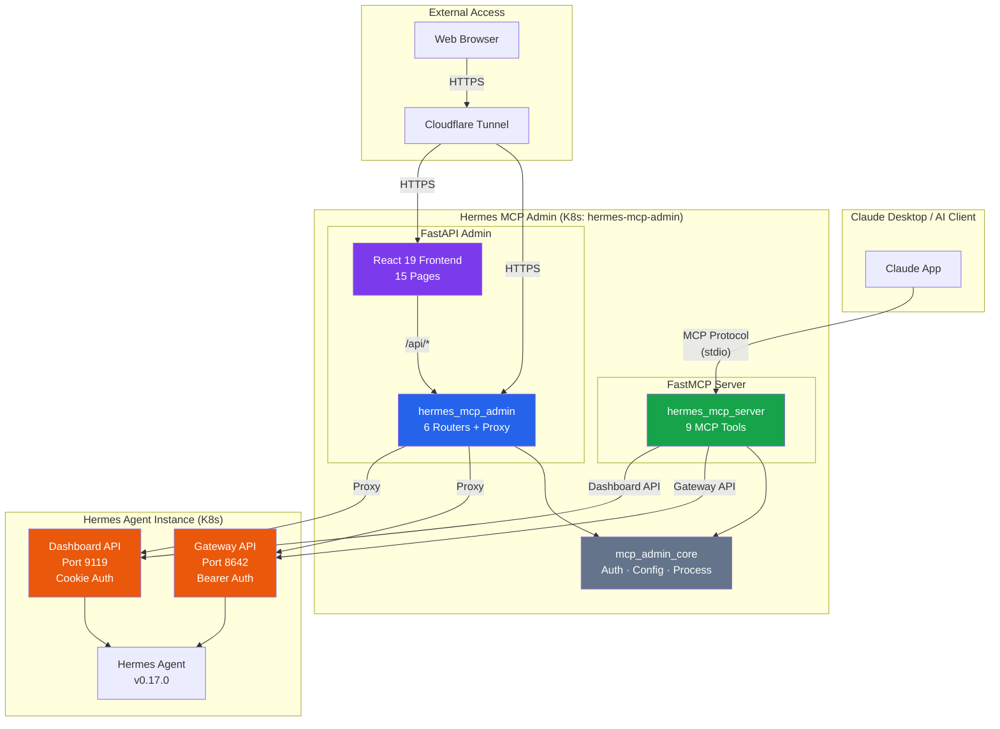
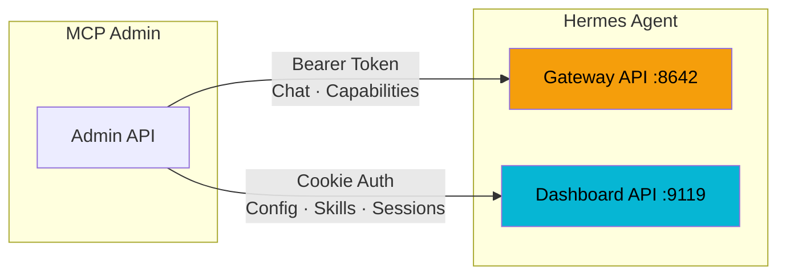
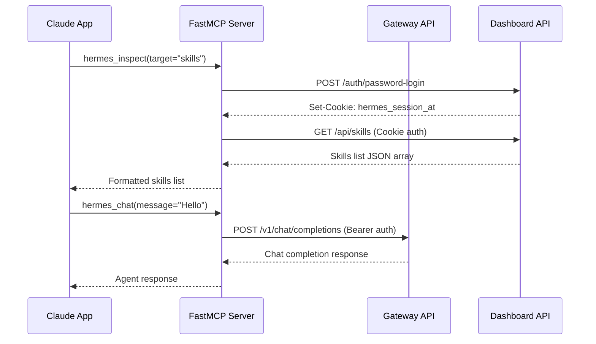
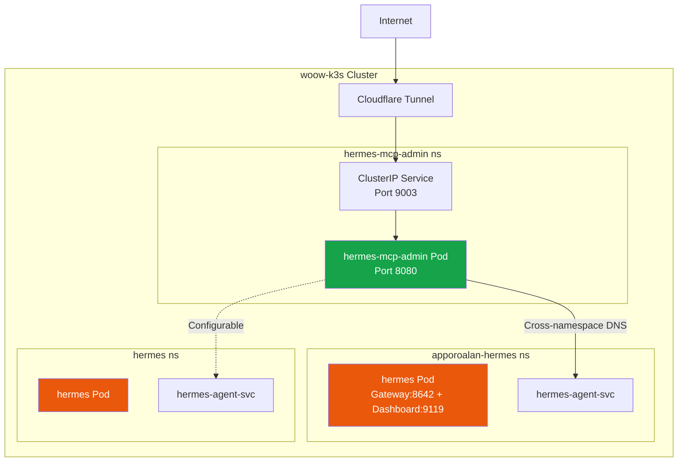

# Architecture

## System Overview

```mermaid
graph TB
    subgraph "Claude Desktop / AI Client"
        CD[Claude App]
    end

    subgraph "Hermes MCP Admin (K8s: hermes-mcp-admin)"
        direction TB
        subgraph "FastMCP Server"
            MCP[hermes_mcp_server<br/>9 MCP Tools]
        end
        subgraph "FastAPI Admin"
            API[hermes_mcp_admin<br/>6 Routers + Proxy]
            FE[React 19 Frontend<br/>15 Pages]
        end
        CORE[mcp_admin_core<br/>Auth · Config · Process]
    end

    subgraph "Hermes Agent Instance (K8s)"
        GW[Gateway API<br/>Port 8642<br/>Bearer Auth]
        DB[Dashboard API<br/>Port 9119<br/>Cookie Auth]
        AGENT[Hermes Agent<br/>v0.17.0]
    end

    subgraph "External Access"
        CF[Cloudflare Tunnel]
        BROWSER[Web Browser]
    end

    CD -- "MCP Protocol<br/>(stdio)" --> MCP
    MCP --> CORE
    API --> CORE
    FE -- "/api/*" --> API
    API -- "Proxy" --> GW
    API -- "Proxy" --> DB
    MCP -- "Gateway API" --> GW
    MCP -- "Dashboard API" --> DB
    GW --> AGENT
    DB --> AGENT
    CF -- "HTTPS" --> API
    CF -- "HTTPS" --> FE
    BROWSER -- "HTTPS" --> CF

    style MCP fill:#16a34a,color:#fff
    style API fill:#2563eb,color:#fff
    style FE fill:#7c3aed,color:#fff
    style CORE fill:#64748b,color:#fff
    style GW fill:#ea580c,color:#fff
    style DB fill:#ea580c,color:#fff
```

## Dual Connection Architecture

```mermaid
graph LR
    subgraph "MCP Admin"
        A[Admin API]
    end

    subgraph "Hermes Agent"
        G[Gateway API :8642]
        D[Dashboard API :9119]
    end

    A -->|"Bearer Token<br/>Chat · Capabilities"| G
    A -->|"Cookie Auth<br/>Config · Skills · Sessions"| D

    style G fill:#f59e0b,color:#000
    style D fill:#06b6d4,color:#000
```

## Module Structure

```mermaid
graph BT
    subgraph "hermes_mcp_server"
        T1[hermes_inspect]
        T2[hermes_session]
        T3[hermes_skill]
        T4[hermes_model]
        T5[hermes_config]
        T6[hermes_gateway]
        T7[hermes_chat]
        T8[hermes_tools]
        T9[hermes_mcp_server_manage]
    end

    subgraph "hermes_mcp_admin"
        R1[config router]
        R2[health router]
        R3[tools router]
        R4[tokens router]
        R5[logs router]
        R6[dashboard_proxy router]
    end

    subgraph "mcp_admin_core"
        C1[AuthMiddleware]
        C2[ConfigStore]
        C3[ProcessManager]
        C4[Settings Router]
        C5[Login Router]
        C6[Proxy Router]
    end

    T1 & T2 & T3 & T4 & T5 & T6 & T7 & T8 & T9 --> C2
    R1 & R2 & R3 & R4 & R5 & R6 --> C1
    R1 & R2 & R3 & R4 & R5 & R6 --> C2

    style C1 fill:#64748b,color:#fff
    style C2 fill:#64748b,color:#fff
    style C3 fill:#64748b,color:#fff
```

## Data Flow

```mermaid
sequenceDiagram
    participant User as Claude App
    participant MCP as FastMCP Server
    participant GW as Gateway API
    participant DB as Dashboard API

    User->>MCP: hermes_inspect(target="skills")
    MCP->>DB: POST /auth/password-login
    DB-->>MCP: Set-Cookie: hermes_session_at
    MCP->>DB: GET /api/skills (Cookie auth)
    DB-->>MCP: Skills list JSON array
    MCP-->>User: Formatted skills list

    User->>MCP: hermes_chat(message="Hello")
    MCP->>GW: POST /v1/chat/completions (Bearer auth)
    GW-->>MCP: Chat completion response
    MCP-->>User: Agent response
```

## Deployment Topology

```mermaid
graph TB
    subgraph "woow-k3s Cluster"
        subgraph "hermes-mcp-admin ns"
            POD1[hermes-mcp-admin Pod<br/>Port 8080]
            SVC1[ClusterIP Service<br/>Port 9003]
        end

        subgraph "apporoalan-hermes ns"
            POD2[hermes Pod<br/>Gateway:8642 + Dashboard:9119]
            SVC2[hermes-agent-svc]
        end

        subgraph "hermes ns"
            POD3[hermes Pod]
            SVC3[hermes-agent-svc]
        end

        CF[Cloudflare Tunnel]
    end

    INET[Internet] --> CF
    CF --> SVC1
    SVC1 --> POD1
    POD1 -->|"Cross-namespace DNS"| SVC2
    POD1 -.->|"Configurable"| SVC3

    style POD1 fill:#16a34a,color:#fff
    style POD2 fill:#ea580c,color:#fff
    style POD3 fill:#ea580c,color:#fff
```
